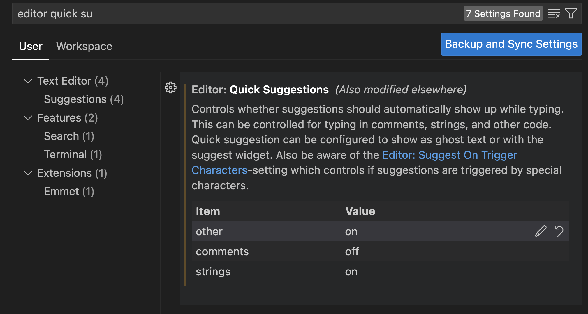

# React

## outline

## Setup React Project

- `npm create vite@latest`
- `npm install -D tailwindcss postcss autoprefixer`
- `npx tailwindcss init -p`
- `npm i lucide-react`
- Tailwind CSS IntelliSense, ESLint VSCode Extension

tailwind.config.js

```js
content: [
    "./index.html",
    "./src/**/*.{js,ts,jsx,tsx}",
  ],
```

index.css

```css
@tailwind base;
@tailwind components;
@tailwind utilities;
```

- delete App.css file, and delete the import in App.js




## imperative vs declarative

imperative focus 在如何做，而 declarative focus 在做什么。


## Project start

1. create types/todo.ts file in src folder

    ```ts
    export interface Todo {
        id: number
        title: string
        completed: boolean
    }
    ```

2. create data/todos.ts file in src folder

    ```ts
    // todos.ts
    import { Todo } from "../types/todo";

    export const dummyData:Todo[]= [
        {
            id: 1,
            title: "Like this video ",
            completed: false
        },
        {
            id: 2,
            title: "Subscribe to Coding in Flow",
            completed: false
        },  
        {
            id: 3,
            title: "Leave a nice comment",
            completed: false
        },
    ]
    ```

## React Components

目的：將程式碼分割成小塊，讓程式碼更容易維護，並且可以重複使用。

1. create components/TodoItem.tsx file in src folder

    ```tsx
        import { Todo } from '../types/todo'

    interface TodoItemProps {
        todo: Todo
    }


    export const TodoItem = ({todo}: TodoItemProps) => {
    return (
        <div>
            <label className='flex item-centre gap-2 border rounded-mds p-2 border-gray-400 bg-white hover:bg-slate-50'>
                <input type="checkbox" className="scale-125" />
                <span className={todo.completed ? "line-throufh text-gray-400" : ""}>
                    {todo.title}
                </span>
            </label>
        </div>
    )
    }

    export default TodoItem
    ```

## 單向數據流

我們在components中有狀態，我們可以通過props將這個狀態傳遞給較小的組件。我們可以通過callbacks將狀態傳遞給較大的組件。


## State

## props drilling 